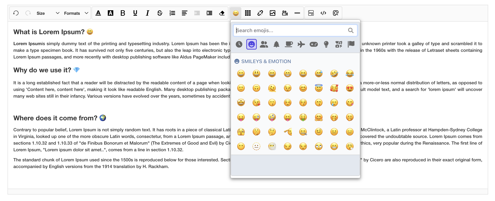

# Emoji Plugin for SunEditor

This plugin integrates emoji support into [SunEditor](https://github.com/JiHong88/suneditor) using the [Picmo](https://github.com/joeattardi/picmo) library. With this plugin, users can easily insert emojis into text, enhancing the user experience with expressive symbols.



## Features

- Easy integration
- Utilizes the Picmo library for a rich set of emojis.
- User-friendly interface for selecting and inserting emojis.
- Lightweight and efficient (no additional libraries except Picmo).

## Installation

To install the plugin, follow these steps:

1. Add the Emoji Plugin to your project. You can either download the source code or install it via npm:

```sh
npm install suneditor-picmo-emoji
```

## Usage

Here is a basic example of how to integrate the Emoji Plugin into your editor:


1. Initialize the Picmo emoji picker and integrate it with your editor:

```js
import { picmo }  from 'suneditor-picmo-emoji'
```

2. Add a plugin in your config:

```js
suneditor.create('editor', {
    plugins: [
        picmo
    ]
})
```

3. Add "picmo" to your button list:

```javascript
...
buttonList: [
    [
        'picmo'
    ]
]
...
```

4. Now, when you run your project, the emoji picker should be integrated with your editor, allowing users to easily insert emojis.

## Contributing

We welcome contributions to improve this plugin! Please follow these steps to contribute:

1. Fork the repository.
2. Create a new branch for your feature or bug fix.
3. Make your changes and commit them with descriptive messages.
4. Push your changes to your forked repository.
5. Open a pull request to the main repository.

## License

This project is licensed under the MIT License. See the [LICENSE.md](LICENSE.md) file for more details.

## Acknowledgements

- [SunEditor](https://github.com/JiHong88/suneditor) - Excellent WYSIWYG editor.
- [Picmo](https://github.com/joeattardi/picmo) - The emoji picker library used in this plugin.

## Contact

For questions or support, please open an issue on GitHub.